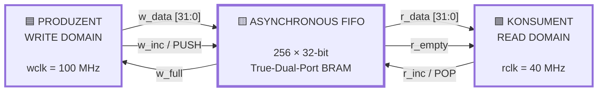
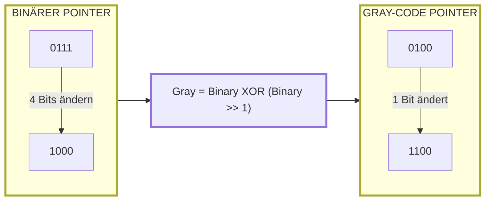
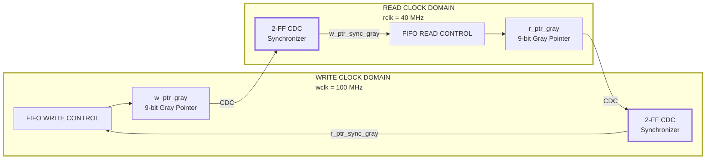
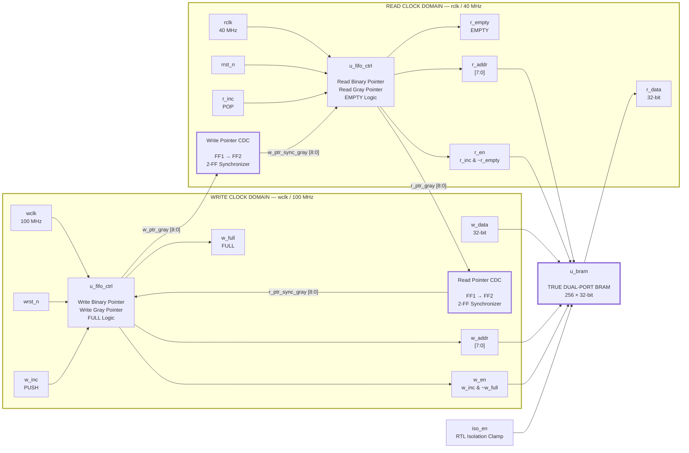
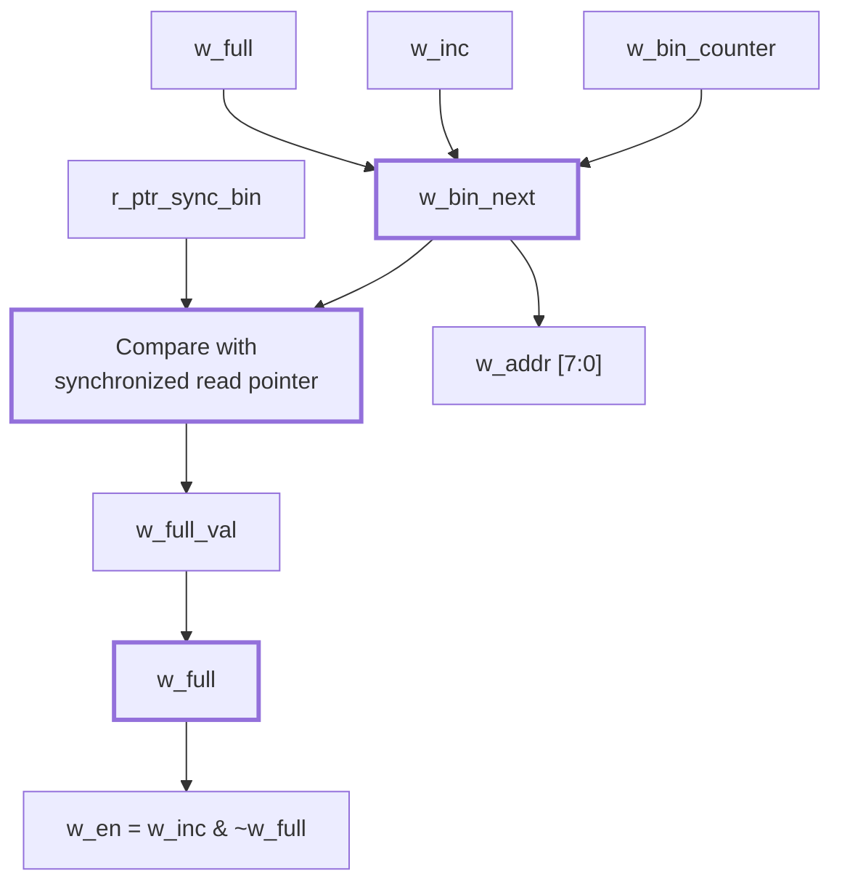
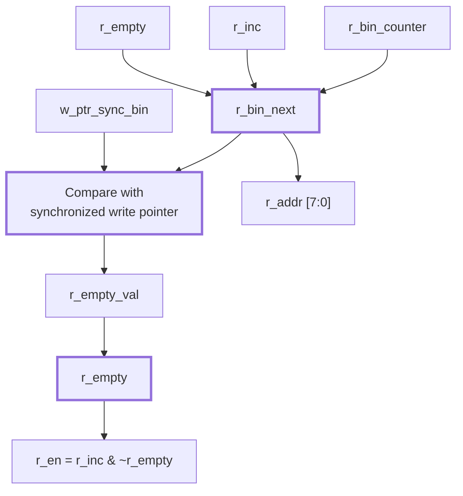
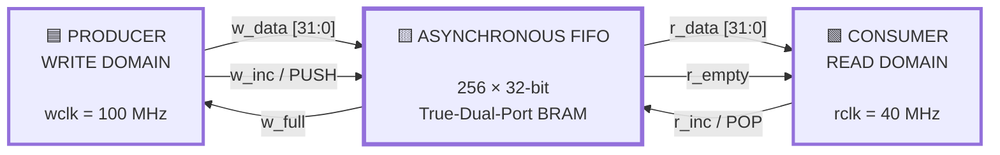
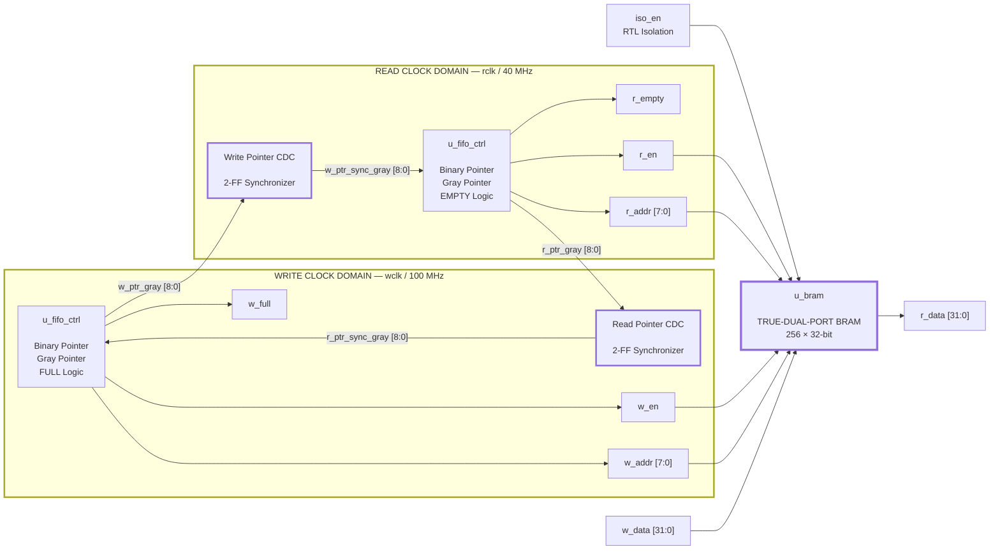

# Async-CDC-FIFO — Asynchronous Clock Domain Crossing FIFO

A True-Dual-Port BRAM-based **asynchronous First-In-First-Out (FIFO)** for safe data transfer between two independent clock domains.

|                         |                                                             |
| ----------------------- | ----------------------------------------------------------- |
| **Version**             | **v1.0**                                                    |
| **Language**            | **[🇩🇪 DEUTSCH](#deutsch)** · **[🇬🇧 ENGLISH](#english)** |
| **RTL Simulation**      | Icarus Verilog (`iverilog` / `vvp`)                         |
| **Physical Design**     | OpenLane Flow · SkyWater PDK `sky130A`                      |
| **CDC Technique**       | Gray-Code Pointers + 2-FF Synchronizers                     |
| **Memory**              | True-Dual-Port BRAM, 256 × 32-bit                           |
| **Power Intent**        | UPF specification + RTL isolation model                     |
| **Physical UPF Status** | ⚠️ **Not applied in the reported OpenLane run**             |

---

# DEUTSCH

> **English version:** [🇬🇧 Zum englischen Abschnitt / Go to English](#english)

## 1. Warum braucht man ein asynchrones CDC-FIFO?

Ein FIFO („First In – First Out“) wird benötigt, wenn zwei Schaltungen **unabhängige Taktquellen** verwenden.

In diesem Design gibt es zwei vollständig unabhängige Clock-Domänen:

* **`wclk` — 100 MHz:** Schreibseite / Produzent
* **`rclk` — 40 MHz:** Leseseite / Konsument

Die beiden Takte sind weder frequenz- noch phasensynchron.

### Das Problem

Beim direkten Übertragen von Signalen zwischen solchen Clock-Domänen entstehen mehrere Probleme:

### 1. Keine gemeinsame Zeitbasis

Die beiden Clock-Signale sind hinsichtlich Frequenz und Phase unabhängig. Es gibt daher keine Garantie dafür, wann ein Signal von der empfangenden Domäne abgetastet wird.

### 2. Metastabilität

Wechselt ein Signal nahe an der Setup-/Hold-Grenze eines Flip-Flops, kann das Flip-Flop metastabil werden. Der Ausgang benötigt dann eine unbestimmte Zeit, um in einen stabilen logischen Zustand zurückzukehren.

### 3. Mehrbit-Pointer

Ein binärer Zähler kann beim Übergang mehrere Bits gleichzeitig ändern.

Beispielsweise:

```text
0111 → 1000
```

Hier ändern sich vier Bits.

Werden diese Bits asynchron und zu leicht unterschiedlichen Zeitpunkten abgetastet, kann die empfangende Domäne eine Kombination sehen, die keinem tatsächlichen Zählerstand entspricht.

### 4. Overflow und Underflow

Da Schreib- und Lesetakt unterschiedlich schnell laufen, muss verhindert werden, dass:

* der Schreiber in einen bereits vollen FIFO schreibt,
* der Leser aus einem leeren FIFO liest.

### Grundidee

Der FIFO löst diese Probleme durch:

1. **Binäre lokale Pointer**
2. **Umwandlung der Pointer in Gray-Code**
3. **2-FF-Synchronisierung über die Clock-Domain-Grenze**
4. **lokale Full-/Empty-Erkennung**
5. **True-Dual-Port-BRAM für die Datenspeicherung**

> **Kurz gesagt:** Der Datenpfad bleibt im Speicher, während nur die Statusinformationen — insbesondere die Schreib- und Lesepointer — kontrolliert über die Clock-Domain-Grenze übertragen werden.

### Systemübersicht



---

## 2. Wie wird das Problem gelöst?

## 2.1 Gray-Code-Pointer

Der wichtigste Bestandteil des CDC-FIFOs ist die Verwendung von **Gray-Code** für die Pointer, die die Clock-Domain-Grenze überschreiten.

Bei einem Gray-Code ändert sich zwischen zwei aufeinanderfolgenden Werten **genau ein Bit**.

Zum Beispiel:

| Dezimal |  Binär | Ändernde Bits | Gray-Code | Ändernde Bits |
| ------: | :----: | ------------: | :-------: | ------------: |
|       0 | `0000` |             — |   `0000`  |             — |
|       1 | `0001` |             1 |   `0001`  |             1 |
|       2 | `0010` |             2 |   `0011`  |             1 |
|       3 | `0011` |             1 |   `0010`  |             1 |
|       4 | `0100` |             3 |   `0110`  |             1 |
|       5 | `0101` |             1 |   `0111`  |             1 |
|       6 | `0110` |             2 |   `0101`  |             1 |
|       7 | `0111` |             1 |   `0100`  |             1 |
|       8 | `1000` |         **4** |   `1100`  |         **1** |

Der Unterschied ist besonders wichtig beim Übergang:

```text
Binary:

0111 → 1000
 ↑↑↑↑   ↑↑↑↑
4 Bits ändern sich


Gray:

0100 → 1100
      ↑
  nur 1 Bit ändert sich
```

Die Gray-Codierung wird mit folgender Formel erzeugt:

```text
Gray = Binary XOR (Binary >> 1)
```

### Warum ist das für CDC hilfreich?

Wenn der Gray-Pointer die Clock-Domain-Grenze überquert, gibt es zwischen zwei gültigen Pointerständen nur **eine gleichzeitig wechselnde Bitposition**.

Das reduziert die Gefahr, dass die empfangende Domäne aufgrund unterschiedlich verzögerter Bits einen völlig inkonsistenten Mehrbit-Pointer beobachtet.

> Wichtig: Gray-Code verhindert **nicht** Metastabilität. Das einzelne wechselnde Bit kann weiterhin metastabil werden. Gray-Code begrenzt jedoch die Mehrbit-Übergangsproblematik, während die nachgeschaltete 2-FF-Synchronisierung die Wahrscheinlichkeit reduziert, dass Metastabilität in die Ziel-Logik gelangt.

### Gray-Code-Übergang



---

## 2.2 Crossing der Clock-Domain-Grenze — 2-FF-Synchronisierer

Die Gray-Pointer werden anschließend mit einer **2-FF-Synchronizer-Kette** in die jeweils andere Clock-Domäne übertragen.

### Write → Read

```text
w_ptr_gray
    │
    ▼
┌────────────────────┐
│ Synchronizer FF #1 │  ← rclk
└────────────────────┘
    │
    ▼
┌────────────────────┐
│ Synchronizer FF #2 │  ← rclk
└────────────────────┘
    │
    ▼
w_ptr_sync_gray
```

### Read → Write

```text
r_ptr_gray
    │
    ▼
┌────────────────────┐
│ Synchronizer FF #1 │  ← wclk
└────────────────────┘
    │
    ▼
┌────────────────────┐
│ Synchronizer FF #2 │  ← wclk
└────────────────────┘
    │
    ▼
r_ptr_sync_gray
```

Die beiden Richtungen sind vollständig unabhängig:



---

## 2.3 Full-/Empty-Erkennung

Die Statusflags werden immer in ihrer **lokalen Clock-Domäne** berechnet.

### Write-Domäne

`w_full` wird anhand des nächsten Schreib-Pointers und des synchronisierten Lesepointers bestimmt.

```text
w_bin_next
     │
     ├──────────────┐
     │              │
     ▼              ▼
WRITE POINTER    SYNC READ POINTER
     │              │
     └──────┬───────┘
            ▼
       FULL COMPARE
            │
            ▼
         w_full
```

Der verwendete Vergleich im RTL ist:

```systemverilog
w_full_val =
    (w_bin_next ==
     {~r_ptr_sync_bin[ADDR_WIDTH],
      r_ptr_sync_bin[ADDR_WIDTH-1:0]});
```

Das bedeutet: Der Schreibpointer liegt eine vollständige FIFO-Runde vor dem synchronisierten Lesepointer.

---

### Read-Domäne

`r_empty` wird anhand des nächsten Lesepointers und des synchronisierten Schreibpointers bestimmt.

```text
r_bin_next
     │
     ├──────────────┐
     │              │
     ▼              ▼
READ POINTER     SYNC WRITE POINTER
     │              │
     └──────┬───────┘
            ▼
       EMPTY COMPARE
            │
            ▼
         r_empty
```

Im RTL:

```systemverilog
r_empty_val = (r_bin_next == w_ptr_sync_bin);
```

---

### Schreib- und Lesezugriffe werden durch die Flags geschützt

```systemverilog
w_en = w_inc & ~w_full;
r_en = r_inc & ~r_empty;
```

Damit gilt:

```text
w_full  = 1  →  WRITE BLOCKED
r_empty = 1  →  READ BLOCKED
```

Die kleine Verzögerung durch die 2-FF-Synchronisierung ist bei einem asynchronen FIFO normal. Ein Status kann daher erst nach einigen Ziel-Clock-Zyklen auf eine Änderung in der anderen Domäne reagieren.

---

# 3. Architektur

## 3.1 Modulstruktur

```text
async_fifo.sv
│
├── async_fifo
│   │
│   ├── u_fifo_ctrl
│   │   ├── u_w_b2g
│   │   ├── u_r_b2g
│   │   ├── u_w_g2b
│   │   └── u_r_g2b
│   │
│   ├── u_bram
│   │
│   ├── Write → Read 2-FF Synchronizer
│   │
│   └── Read → Write 2-FF Synchronizer
│
├── fifo_controller.sv
├── dual_port_bram.sv
├── binary_to_gray.sv
└── gray_to_binary.sv
```

### Komponenten

| Komponente           | Aufgabe                                |
| -------------------- | -------------------------------------- |
| `async_fifo`         | Top-Level-Verbindung aller Komponenten |
| `fifo_controller`    | Pointer, Gray-Code, Full/Empty         |
| `dual_port_bram`     | 256 × 32-bit True-Dual-Port-Speicher   |
| `binary_to_gray`     | Binär → Gray                           |
| `gray_to_binary`     | Gray → Binär                           |
| 2× 2-FF Synchronizer | CDC der Gray-Pointer                   |

---

## 3.2 Vollständiges Blockdiagramm



### Datenfluss

```text
WRITE DOMAIN
     │
     │ w_data
     ▼
┌──────────────────────────┐
│                          │
│      TRUE-DUAL-PORT      │
│          BRAM            │
│                          │
│      256 × 32-bit        │
│                          │
└──────────────────────────┘
     │
     │ r_data
     ▼
READ DOMAIN
```

### Pointerfluss

```text
             WRITE DOMAIN
                  │
            w_ptr_gray
                  │
                  ▼
             ┌─────────┐
             │ 2 × FF  │
             │   CDC   │
             └─────────┘
                  │
                  ▼
              READ DOMAIN


             READ DOMAIN
                  │
            r_ptr_gray
                  │
                  ▼
             ┌─────────┐
             │ 2 × FF  │
             │   CDC   │
             └─────────┘
                  │
                  ▼
             WRITE DOMAIN
```

---

# 4. Full-/Empty-Logik im Detail

## Write side



## Read side



---

# 5. Schnittstellen

| Port      | Richtung | Breite | Domäne | Beschreibung                               |
| --------- | :------: | :----: | ------ | ------------------------------------------ |
| `iso_en`  |   input  |    1   | —      | RTL-Isolationssignal; klemmt den Read-Pfad |
| `wclk`    |   input  |    1   | write  | Schreib-Takt                               |
| `wrst_n`  |   input  |    1   | write  | asynchroner, aktiv-niedriger Write-Reset   |
| `w_inc`   |   input  |    1   | write  | Schreibanforderung / PUSH                  |
| `w_full`  |  output  |    1   | write  | FIFO FULL                                  |
| `w_data`  |   input  |   32   | write  | Schreibdaten                               |
| `rclk`    |   input  |    1   | read   | Lese-Takt                                  |
| `rrst_n`  |   input  |    1   | read   | asynchroner, aktiv-niedriger Read-Reset    |
| `r_inc`   |   input  |    1   | read   | Leseanforderung / POP                      |
| `r_empty` |  output  |    1   | read   | FIFO EMPTY                                 |
| `r_data`  |  output  |   32   | read   | Lesedaten                                  |

### Parameter

```text
DATA_WIDTH = 32
ADDR_WIDTH = 8

FIFO DEPTH = 2^ADDR_WIDTH
           = 2^8
           = 256 words

POINTER WIDTH = ADDR_WIDTH + 1
              = 9 bits
```

Das zusätzliche Pointer-MSB wird benötigt, um zwischen gleichen Speicheradressen in unterschiedlichen FIFO-Umdrehungen zu unterscheiden.

---

# 6. Dateien und Module

| Datei                                    | Modul / Inhalt    | Beschreibung                          |
| ---------------------------------------- | ----------------- | ------------------------------------- |
| `physical_design/rtl/async_fifo.sv`      | `async_fifo`      | Top-Level                             |
| `physical_design/rtl/fifo_controller.sv` | `fifo_controller` | Pointer, Gray-Code und Full/Empty     |
| `physical_design/rtl/dual_port_bram.sv`  | `dual_port_bram`  | True-Dual-Port-BRAM                   |
| `physical_design/rtl/binary_to_gray.sv`  | `binary_to_gray`  | Binär → Gray                          |
| `physical_design/rtl/gray_to_binary.sv`  | `gray_to_binary`  | Gray → Binär                          |
| `logic_design/tb_async_fifo.sv`          | Testbench         | Basis-Testbench mit 6 Fällen          |
| `logic_design/tb_new_async_fifo.sv`      | Testbench         | 10 Fälle + Scoreboard                 |
| `logic_design/async_fifo.upf`            | UPF               | Power-Domain-/Isolation-Spezifikation |
| `physical_design/constraints.sdc`        | SDC               | Clock- und Timing-Constraints         |

---

# 7. RTL-Simulation mit Icarus Verilog

Voraussetzungen:

```bash
iverilog
vvp
```

Simulation:

```bash
iverilog -g2012 -s tb_async_fifo \
  -o logic_design/async_fifo_sim \
  physical_design/rtl/async_fifo.sv \
  physical_design/rtl/fifo_controller.sv \
  physical_design/rtl/dual_port_bram.sv \
  physical_design/rtl/binary_to_gray.sv \
  physical_design/rtl/gray_to_binary.sv \
  logic_design/tb_async_fifo.sv

vvp logic_design/async_fifo_sim
```

Die Testbenches erzeugen VCD-Waveforms, beispielsweise:

```text
async_fifo_cases.vcd
async_fifo_cases_1.vcd
```

Diese können anschließend mit GTKWave analysiert werden.

---

## 7.1 Testabdeckung

Die neue Testbench `tb_new_async_fifo.sv` enthält zehn Szenarien:

| Fall | Szenario                             | Prüfziel                           |
| :--: | ------------------------------------ | ---------------------------------- |
|   1  | Gleiche Frequenz / Phase             | korrekte Datenübertragung          |
|   2  | Schnelles Schreiben, langsames Lesen | `w_full`, kein Overwrite           |
|   3  | Langsames Schreiben, schnelles Lesen | `r_empty`, kein Over-read          |
|   4  | Leser hängt                          | Overflow wird blockiert            |
|   5  | Simultaner Verkehr                   | Datenintegrität                    |
|   6  | Verkehr nahe FULL                    | Full-Erkennung und Wiederaufnahme  |
|   7  | Verkehr nahe EMPTY                   | Empty-Erkennung und Wiederaufnahme |
|   8  | Schreiber hängt                      | Underflow wird blockiert           |
|   9  | Pointer Wrap-Around                  | mehrere FIFO-Umdrehungen           |
|  10  | Randomized Stress                    | End-to-End Scoreboard              |

Die Scoreboard-Testbench vergleicht die tatsächlich gelesenen Daten mit einer internen Referenz-Queue.

Erwartetes Ergebnis:

```text
Result: ALL TEST CASES PASSED SUCCESSFULLY!
```

---

# 8. Physikalisches Design — OpenLane + SkyWater SKY130A

Das Design wurde durch einen vollständigen OpenLane-Physical-Design-Flow verarbeitet:

```text
RTL
 │
 ▼
Synthesis
 │
 ▼
Floorplan
 │
 ▼
Placement
 │
 ▼
CTS
 │
 ▼
Routing
 │
 ▼
GDSII
```

Verwendetes PDK:

```text
SkyWater SKY130A
130 nm
```

---

## 8.1 OpenLane-Konfiguration

Verwendete Clock-Perioden:

```text
wclk = 10 ns  → 100 MHz
rclk = 25 ns  → 40 MHz
```

Die beiden Clock-Domänen wurden als asynchron definiert.

Beispielhafte Konfiguration:

```json
{
  "DESIGN_NAME": "async_fifo",

  "CLOCK_PERIODS": {
    "wclk": 10.0,
    "rclk": 25.0
  },

  "CLOCK_PORTS": [
    "wclk",
    "rclk"
  ],

  "RUN_UPF_FLOW": true,

  "UPF_FILE": "dir::async_fifo.upf",

  "SDC_FILE": "dir::constraints.sdc",

  "DIE_AREA": [
    0,
    0,
    1400,
    1400
  ],

  "PL_TARGET_DENSITY": 0.55,

  "VDD_NETS": [
    "vccd1"
  ],

  "GND_NETS": [
    "vssd1"
  ]
}
```

> **Important:** Die Konfiguration oben beschreibt die beabsichtigte Flow-Konfiguration. Die tatsächlich ausgeführten Artefakte zeigen jedoch, dass der UPF-Flow in dem unten dokumentierten Run **nicht wirksam angewendet wurde**. Details dazu stehen in Abschnitt 9.

---

# 9. UPF / Power-Gating — tatsächlicher Flow-Status

Das Projekt enthält eine UPF-Spezifikation für Power-Management:

```text
logic_design/async_fifo.upf
```

Vorgesehen war eine Power-Domain:

```text
TOP
 │
 └── PD_FIFO
      ├── u_bram
      └── u_fifo_ctrl
```

mit einer aktiven High-Isolierung:

```text
iso_en = 1
      │
      ▼
r_data → 0
```

Beispiel der UPF-Spezifikation:

```upf
create_power_domain PD_FIFO \
    -elements {u_bram u_fifo_ctrl}

set_isolation iso_rule \
    -domain PD_FIFO \
    -clamp_value 0 \
    -signal iso_en \
    -active_high
```

## ⚠️ Tatsächliches Ergebnis des Physical-Design-Runs

Die Analyse des Runs `RUN_2026-08-30_16-22-44` hat gezeigt:

**UPF Power-Gating wurde in diesem Run nicht physikalisch angewendet.**

Es wurden keine entsprechenden Artefakte gefunden:

```text
PD_FIFO
iso_rule
async_fifo.upf
isolation cells
power switches
```

Auch die verwendete Synthese-Konfiguration enthielt keinen wirksamen UPF-Verweis.

Der Root-Eintrag

```json
"UPF_FILE": "dir::async_fifo.upf"
```

verwies auf einen Pfad, der in dieser Verzeichnisstruktur nicht existiert.

Die tatsächliche UPF-Datei befindet sich unter:

```text
logic_design/async_fifo.upf
```

### Konsequenz

Das bedeutet:

```text
RTL isolation model
        ≠
physical UPF implementation
```

`iso_en` existiert weiterhin als **funktionales RTL-Modell**, aber die gemeldeten Physical-Design-Ergebnisse enthalten **keine tatsächlich eingefügten Power-Switches oder Isolation Cells aufgrund dieses UPF-Flows**.

Daher sollte dieser Run **nicht als physikalisch UPF-implementiertes Power-Gating-Design** bezeichnet werden.

> **Status:** UPF specification present · RTL isolation present · physical UPF implementation **not applied in this run**

---

# 10. SDC / Timing Constraints

Im Gegensatz zum UPF wurde die SDC-Konfiguration tatsächlich in den Physical-Design-Schritten wirksam.

Die erzeugten per-step SDC-Dateien wurden überprüft und enthalten:

* `wclk = 10 ns`
* `rclk = 25 ns`
* asynchrone Clock-Groups
* I/O Delays
* Driving-Cell-Informationen

Grundlegende Clock-Definition:

```tcl
create_clock -name wclk -period 10.0 [get_ports wclk]

create_clock -name rclk -period 25.0 [get_ports rclk]

set_clock_groups -asynchronous \
    -group {wclk} \
    -group {rclk}
```

Damit sind die beiden Clock-Domänen für das Timing als asynchron definiert.

---

# 11. Physical-Design-Ergebnisse

Run:

```text
RUN_2026-08-30_16-22-44
```

## Flow

| Kennzahl          |            Ergebnis |
| ----------------- | ------------------: |
| OpenLane Flow     |       **Completed** |
| Flow Steps        |              **77** |
| Lint/Latch Errors |               **0** |
| Instance Count    |          **51,304** |
| Instance Area     |   ≈ **399,107 µm²** |
| Core Area         | ≈ **1,911,350 µm²** |
| Die Area          | **1400 × 1400 µm²** |

---

## 11.1 Power

| Kategorie   |           Wert |
| ----------- | -------------: |
| Total Power | ≈ **0.156 mW** |
| Switching   | ≈ **0.060 mW** |
| Internal    | ≈ **0.095 mW** |
| Leakage     |   ≈ **0.4 µW** |

> Die Power-Zahlen sollten zusammen mit den unten beschriebenen Timing-/DRV-Einschränkungen und insbesondere dem fehlenden physikalischen UPF-Implementierungsstatus interpretiert werden.

---

# 12. Timing-Ergebnisse

Die Timing-Ergebnisse sind **nicht an allen PVT-Corners vollständig clean**.

## Setup

| Corner         |    Setup WNS | Status       |
| -------------- | -----------: | ------------ |
| `tt_025C_1v80` | **+2.40 ns** | ✅ Clean      |
| `ss_100C_1v60` | **−1.05 ns** | ⚠️ Violation |

Im Worst-Case-Corner wurde mindestens eine Setup-Verletzung festgestellt.

Zusätzlich wurden Werte von ungefähr:

```text
min_ss ≈ −0.88 ns
max_ss ≈ −1.27 ns
```

beobachtet.

OpenLane meldete:

```text
[RSZ-0062] Unable to repair all setup violations
```

### Hold

```text
Hold violations = 0
Hold WNS = 0 ns
```

### Interpretation

Der nominelle/signoff-nahe `tt`-Corner ist mit:

```text
WNS = +2.40 ns
```

clean.

Der Slow-Slow-Corner `ss_100C_1v60` besitzt jedoch eine verbleibende Setup-Verletzung von:

```text
WNS = -1.05 ns
```

Daher sollte das Design **nicht als timing-clean über alle analysierten PVT-Corners** bezeichnet werden.

---

# 13. Design Rule / DRV Findings

Neben Setup-Timing wurden mehrere maximale Slew-/Capacitance-Probleme festgestellt.

## Max-Slew

| Corner   | Violations |
| -------- | ---------: |
| `tt`     |     **34** |
| `ss-nom` |    **601** |
| `ss-max` |   **3703** |

Die maximal beobachtete Capacitance lag bei ungefähr:

```text
82
```

Die Ursache ist hauptsächlich das große kombinatorische Netzwerk, das aus der Implementierung des:

```text
32-bit × 256-entry register-file / mux network
```

entsteht.

Das ist insbesondere für diese Implementierung relevant, da der RTL-Speicher als Register-/Mux-Struktur synthetisiert wurde, anstatt als physikalischer SKY130-SRAM-Macro.

---

# 14. PDN / Routing Findings

Während des Global-Routing-/PDN-Prozesses traten wiederholt Meldungen wie:

```text
[GRT-0041] Net vccd1 has wires/vias outside die area
```

auf.

Diese Meldungen beziehen sich auf den PDN-Ring bzw. die entsprechende Versorgungstopologie.

Trotz dieser Meldungen:

```text
Magic DRC       = 0
KLayout DRC     = 0
LVS             = 0
IR Drop         ≈ 0.08 %
```

Damit wurden die finalen DRC-/LVS-Prüfungen bestanden.

---

# 15. DRC / LVS / Antenna

## Final Signoff

| Check                   |          Ergebnis |
| ----------------------- | ----------------: |
| Magic DRC               |      **0 errors** |
| KLayout DRC             |      **0 errors** |
| LVS                     | **0 differences** |
| Antenna violations      |   **0 remaining** |
| Antenna diodes inserted |           **215** |

Die ursprünglichen Antennenprobleme wurden durch die Einfügung von insgesamt:

```text
215 antenna diodes
```

behoben.

---

# 16. Lint Findings

Der Flow meldete insgesamt viele Lint-Warnings.

Davon waren:

```text
441 / 447
```

auf `TIMESCALEMOD`-Meldungen zurückzuführen.

Diese stammen hauptsächlich aus den verwendeten Synthese-Blackboxes und sind für die eigentliche FIFO-Funktionalität nicht kritisch.

Daher gilt:

```text
Lint Errors  = 0
Lint Warnings > 0
```

Die Warnings sollten nicht mit funktionalen RTL-Fehlern verwechselt werden.

---

# 17. RTL- und Testbench-Bekannte Punkte

Die folgenden Punkte sind bekannt und werden bewusst dokumentiert.

## 17.1 `r_data` hält alten Wert

Wenn:

```text
r_en = 0
```

wird kein neuer Speicherwert gelesen.

Daher kann `r_data` den zuletzt gelesenen Wert halten.

Das ist für ein FIFO mit aktivem Read-Enable normal, solange der Consumer `r_data` nur bei einem gültigen Read (`r_inc` und nicht `r_empty`) auswertet.

---

## 17.2 `iso_en`

`iso_en` wirkt im aktuellen RTL als funktionale Isolation des Read-Pfads.

Das bedeutet jedoch nicht, dass physikalische Isolation Cells im gemeldeten OpenLane-Run vorhanden sind.

Siehe:

**[UPF / Power-Gating — tatsächlicher Flow-Status](#9-upf--power-gating--tatsächlicher-flow-status)**

---

## 17.3 Header-Kommentare

Es existieren einige kosmetische Kommentarfehler in:

```text
binary_to_gray.sv
fifo_controller.sv
gray_to_binary.sv
```

Beispielsweise verweist ein Kommentar in `binary_to_gray.sv` fälschlicherweise auf „Gray to Binary“.

Diese Kommentare beeinflussen die Synthese oder Funktionalität nicht.

---

## 17.4 Testbench Clock Changes

Die Testbenches ändern teilweise die Clock-Perioden während der Simulation.

Dadurch können künstlich kurze Clock-Edges entstehen.

Diese Änderungen sind für die Stress-/Testfallabdeckung nützlich, sollten aber nicht als physikalisch realistische Clock-Transitions interpretiert werden.

---

# 18. Generated Physical-Design Artifacts

Die finalen Ergebnisse befinden sich unter:

```text
physical_design/runs/RUN_2026-08-30_16-22-44/final/
```

Dort sind unter anderem folgende Artefakte vorhanden:

```text
GDSII
DEF
LEF
SDF
SPEF
SPICE
MAG
Netlist
```

Diese Dateien können für weitere Physical-Verification-, Timing- und Layout-Analysen verwendet werden.

---

# 19. Zusammenfassung des aktuellen Designstatus

| Bereich                   | Status                            |
| ------------------------- | --------------------------------- |
| Async FIFO Architecture   | ✅ Implemented                     |
| Gray-Code CDC             | ✅ Implemented                     |
| 2-FF Synchronizers        | ✅ Implemented                     |
| True-Dual-Port BRAM RTL   | ✅ Implemented                     |
| Full / Empty Protection   | ✅ Implemented                     |
| RTL Simulation            | ✅ Tested                          |
| Scoreboard Verification   | ✅ Implemented                     |
| OpenLane Flow             | ✅ Completed                       |
| SDC Constraints           | ✅ Applied                         |
| TT Setup Timing           | ✅ +2.40 ns                        |
| SS Setup Timing           | ⚠️ −1.05 ns                       |
| Hold Timing               | ✅ 0 violations                    |
| Max Slew                  | ⚠️ Violations remain              |
| PDN GRT warnings          | ⚠️ Present                        |
| Magic DRC                 | ✅ 0                               |
| KLayout DRC               | ✅ 0                               |
| LVS                       | ✅ 0 differences                   |
| Antenna                   | ✅ 0 remaining                     |
| UPF Specification         | ✅ Present                         |
| RTL Isolation Model       | ✅ Present                         |
| Physical UPF Power-Gating | ❌ **Not applied in reported run** |

---

# 20. Changelog

|  Version |    Datum   | Änderungen                                                                                                                                                                           |
| :------: | :--------: | ------------------------------------------------------------------------------------------------------------------------------------------------------------------------------------ |
| **v1.0** | 2026-08-30 | Initial release: asynchronous Gray-code FIFO with True-Dual-Port BRAM, CDC synchronizers, RTL isolation model, Icarus Verilog verification and OpenLane/SKY130A physical-design flow |

---

<div align="center">

### 🇩🇪 Ende der deutschen Dokumentation

**[⬇️ Zum englischen Abschnitt / Go to English](#english)**

</div>

---

# ENGLISH

> **Deutsch:** [🇩🇪 Back to German version](#deutsch)

## 1. Why do you need an asynchronous CDC FIFO?

A FIFO ("First In – First Out") is required whenever two circuits operate using **independent clock sources**.

This design contains two completely independent clock domains:

* **`wclk` — 100 MHz:** write side / producer
* **`rclk` — 40 MHz:** read side / consumer

The two clocks are independent in both frequency and phase.

### The problem

Directly transferring signals between independent clock domains creates several problems:

### 1. No common time base

The two clocks have no guaranteed phase relationship. The receiving domain therefore cannot know exactly when the source signal will change relative to its sampling edge.

### 2. Metastability

If a signal changes close to the setup/hold window of a receiving flip-flop, the flip-flop can become metastable. Its output may then require an uncertain amount of time to resolve to a valid logic level.

### 3. Multi-bit pointers

A binary counter can change multiple bits at the same time.

For example:

```text
0111 → 1000
```

Four bits change during this transition.

If these bits are sampled asynchronously with slightly different propagation delays, the receiving domain can observe a combination that does not correspond to an actual counter state.

### 4. Overflow and underflow

Because the writer and reader operate at different speeds, the control logic must prevent:

* writing into a full FIFO,
* reading from an empty FIFO.

### Solution

The FIFO addresses these problems using:

1. **Local binary pointers**
2. **Gray-code pointer conversion**
3. **2-FF synchronization across clock domains**
4. **Local full/empty generation**
5. **True-dual-port BRAM for data storage**

> **In short:** the data remains inside the memory while the status information — especially the read and write pointers — is safely communicated between the two clock domains.

### System overview



---

## 2. How is the problem solved?

## 2.1 Gray-code pointers

The central CDC technique is the use of **Gray-code pointers** for signals crossing the clock-domain boundary.

A Gray-code sequence changes **exactly one bit** between consecutive values.

| Decimal | Binary | Changed Bits |  Gray  | Changed Bits |
| ------: | :----: | -----------: | :----: | -----------: |
|       0 | `0000` |            — | `0000` |            — |
|       1 | `0001` |            1 | `0001` |            1 |
|       2 | `0010` |            2 | `0011` |            1 |
|       3 | `0011` |            1 | `0010` |            1 |
|       4 | `0100` |            3 | `0110` |            1 |
|       5 | `0101` |            1 | `0111` |            1 |
|       6 | `0110` |            2 | `0101` |            1 |
|       7 | `0111` |            1 | `0100` |            1 |
|       8 | `1000` |        **4** | `1100` |        **1** |

The important difference is:

```text
Binary:

0111 → 1000
 ↑↑↑↑
4 bits change


Gray:

0100 → 1100
      ↑
 only 1 bit changes
```

The conversion is:

```text
Gray = Binary XOR (Binary >> 1)
```

> Gray coding does **not** eliminate metastability. The single changing bit can still become metastable. Its purpose is to prevent a multi-bit binary transition from producing a severely inconsistent sampled pointer. The 2-FF synchronizer then reduces the probability of metastability propagating into the destination logic.

---

## 2.2 Crossing the clock boundary — 2-FF synchronizers

The Gray pointers are transferred into the opposite clock domain using **two-stage flip-flop synchronizers**.

### Write → Read

```text
w_ptr_gray
    │
    ▼
┌────────────────────┐
│ Synchronizer FF #1 │  ← rclk
└────────────────────┘
    │
    ▼
┌────────────────────┐
│ Synchronizer FF #2 │  ← rclk
└────────────────────┘
    │
    ▼
w_ptr_sync_gray
```

### Read → Write

```text
r_ptr_gray
    │
    ▼
┌────────────────────┐
│ Synchronizer FF #1 │  ← wclk
└────────────────────┘
    │
    ▼
┌────────────────────┐
│ Synchronizer FF #2 │  ← wclk
└────────────────────┘
    │
    ▼
r_ptr_sync_gray
```

---

## 2.3 Local full/empty generation

The status flags are calculated entirely within their respective local clock domains.

### Write domain

`w_full` compares the next write pointer against the synchronized read pointer.

```systemverilog
w_full_val =
    (w_bin_next ==
     {~r_ptr_sync_bin[ADDR_WIDTH],
      r_ptr_sync_bin[ADDR_WIDTH-1:0]});
```

### Read domain

`r_empty` compares the next read pointer against the synchronized write pointer.

```systemverilog
r_empty_val = (r_bin_next == w_ptr_sync_bin);
```

### Access gating

```systemverilog
w_en = w_inc & ~w_full;
r_en = r_inc & ~r_empty;
```

Therefore:

```text
w_full  = 1  →  WRITE BLOCKED
r_empty = 1  →  READ BLOCKED
```

The 2-FF synchronization introduces some latency between pointer movement in one domain and flag updates in the other. This is expected behavior in an asynchronous FIFO.

---

# 3. Architecture

```text
async_fifo.sv
│
├── async_fifo
│   │
│   ├── u_fifo_ctrl
│   │   ├── u_w_b2g
│   │   ├── u_r_b2g
│   │   ├── u_w_g2b
│   │   └── u_r_g2b
│   │
│   ├── u_bram
│   │
│   ├── Write → Read 2-FF Synchronizer
│   │
│   └── Read → Write 2-FF Synchronizer
│
├── fifo_controller.sv
├── dual_port_bram.sv
├── binary_to_gray.sv
└── gray_to_binary.sv
```

### Complete architecture



---

# 4. Ports

| Port      | Direction | Width | Domain | Description                         |
| --------- | :-------: | :---: | ------ | ----------------------------------- |
| `iso_en`  |   input   |   1   | —      | RTL isolation control               |
| `wclk`    |   input   |   1   | write  | write clock                         |
| `wrst_n`  |   input   |   1   | write  | asynchronous active-low write reset |
| `w_inc`   |   input   |   1   | write  | write request / PUSH                |
| `w_full`  |   output  |   1   | write  | FIFO full flag                      |
| `w_data`  |   input   |   32  | write  | write data                          |
| `rclk`    |   input   |   1   | read   | read clock                          |
| `rrst_n`  |   input   |   1   | read   | asynchronous active-low read reset  |
| `r_inc`   |   input   |   1   | read   | read request / POP                  |
| `r_empty` |   output  |   1   | read   | FIFO empty flag                     |
| `r_data`  |   output  |   32  | read   | read data                           |

### Parameters

```text
DATA_WIDTH = 32
ADDR_WIDTH = 8

FIFO DEPTH = 256 words

POINTER WIDTH = 9 bits
```

---

# 5. Files and modules

| File                                     | Module / Content  | Description                  |
| ---------------------------------------- | ----------------- | ---------------------------- |
| `physical_design/rtl/async_fifo.sv`      | `async_fifo`      | Top-level                    |
| `physical_design/rtl/fifo_controller.sv` | `fifo_controller` | Pointer and Full/Empty logic |
| `physical_design/rtl/dual_port_bram.sv`  | `dual_port_bram`  | True-dual-port memory        |
| `physical_design/rtl/binary_to_gray.sv`  | `binary_to_gray`  | Binary → Gray                |
| `physical_design/rtl/gray_to_binary.sv`  | `gray_to_binary`  | Gray → Binary                |
| `logic_design/tb_async_fifo.sv`          | Testbench         | Basic 6-case testbench       |
| `logic_design/tb_new_async_fifo.sv`      | Testbench         | 10 cases + scoreboard        |
| `logic_design/async_fifo.upf`            | UPF               | Power/isolation intent       |
| `physical_design/constraints.sdc`        | SDC               | Timing constraints           |

---

# 6. RTL simulation

Prerequisites:

```bash
iverilog
vvp
```

Build and run:

```bash
iverilog -g2012 -s tb_async_fifo \
  -o logic_design/async_fifo_sim \
  physical_design/rtl/async_fifo.sv \
  physical_design/rtl/fifo_controller.sv \
  physical_design/rtl/dual_port_bram.sv \
  physical_design/rtl/binary_to_gray.sv \
  physical_design/rtl/gray_to_binary.sv \
  logic_design/tb_async_fifo.sv

vvp logic_design/async_fifo_sim
```

Generated waveforms include:

```text
async_fifo_cases.vcd
async_fifo_cases_1.vcd
```

They can be inspected with GTKWave.

### Test cases

| Case | Scenario               | Goal                            |
| :--: | ---------------------- | ------------------------------- |
|   1  | Same frequency / phase | correct transfer                |
|   2  | Fast write / slow read | correct `w_full`, no overwrite  |
|   3  | Slow write / fast read | correct `r_empty`, no over-read |
|   4  | Reader stopped         | overflow prevention             |
|   5  | Simultaneous traffic   | CDC data integrity              |
|   6  | Near full              | full detection and recovery     |
|   7  | Near empty             | empty detection and recovery    |
|   8  | Writer stopped         | underflow prevention            |
|   9  | Pointer wrap-around    | multiple FIFO laps              |
|  10  | Randomized stress      | scoreboard consistency          |

The scoreboard compares each read value against an internal reference queue.

Expected result:

```text
Result: ALL TEST CASES PASSED SUCCESSFULLY!
```

---

# 7. Physical design — OpenLane + SKY130A

The design was processed through a 77-step OpenLane physical-design flow:

```text
RTL
 │
 ▼
Synthesis
 │
 ▼
Floorplan
 │
 ▼
Placement
 │
 ▼
CTS
 │
 ▼
Routing
 │
 ▼
GDSII
```

Technology:

```text
SkyWater SKY130A
130 nm
```

Clock definitions:

```text
wclk = 10 ns  → 100 MHz
rclk = 25 ns  → 40 MHz
```

The clocks were constrained as asynchronous groups.

---

# 8. SDC timing constraints

The SDC was **actually applied** by the reported flow.

The generated per-step SDC files were verified to contain:

* `wclk = 10 ns`
* `rclk = 25 ns`
* asynchronous clock groups
* I/O delays
* driving-cell information

Example:

```tcl
create_clock -name wclk -period 10.0 [get_ports wclk]

create_clock -name rclk -period 25.0 [get_ports rclk]

set_clock_groups -asynchronous \
    -group {wclk} \
    -group {rclk}
```

Therefore, the reported timing results are based on the intended asynchronous clock relationship.

---

# 9. UPF and power-gating status

The project contains:

```text
logic_design/async_fifo.upf
```

The intended power architecture consists of:

```text
TOP
 │
 └── PD_FIFO
      ├── u_bram
      └── u_fifo_ctrl
```

with active-high isolation:

```text
iso_en = 1
      │
      ▼
r_data → 0
```

However, investigation of the actual OpenLane run found that:

**UPF power-gating was NOT physically applied.**

There were no physical artifacts corresponding to:

```text
PD_FIFO
iso_rule
Isolation Cells
Power Switches
async_fifo.upf
```

in the generated run.

The root configuration contained:

```json
"UPF_FILE": "dir::async_fifo.upf"
```

but the referenced path did not correspond to the actual file location.

The UPF file was actually located at:

```text
logic_design/async_fifo.upf
```

### Actual interpretation

```text
UPF intent
   │
   ├── Specification exists
   │
   └── Physical implementation
             │
             └── NOT applied in this run
```

The `iso_en` behavior therefore represents an **RTL functional isolation model**, not proof of physical isolation-cell insertion.

---

# 10. Physical-design results

Run:

```text
RUN_2026-08-30_16-22-44
```

| Metric            |              Result |
| ----------------- | ------------------: |
| Flow status       |       **Completed** |
| Flow steps        |              **77** |
| Lint/Latch errors |               **0** |
| Instance count    |          **51,304** |
| Instance area     |   ≈ **399,107 µm²** |
| Core area         | ≈ **1,911,350 µm²** |
| Die area          | **1400 × 1400 µm²** |
| Placement density |            **0.55** |

---

# 11. Power

| Category  |          Value |
| --------- | -------------: |
| Total     | ≈ **0.156 mW** |
| Switching | ≈ **0.060 mW** |
| Internal  | ≈ **0.095 mW** |
| Leakage   |   ≈ **0.4 µW** |

These figures should be interpreted together with the timing/DRV findings and the fact that physical UPF power gating was not applied in this run.

---

# 12. Timing results

Timing is **not clean across every analyzed PVT corner**.

| Corner         |    Setup WNS | Status       |
| -------------- | -----------: | ------------ |
| `tt_025C_1v80` | **+2.40 ns** | ✅ Clean      |
| `ss_100C_1v60` | **−1.05 ns** | ⚠️ Violation |

The slow-slow corner contained remaining setup violations.

Observed values included approximately:

```text
min_ss ≈ −0.88 ns
max_ss ≈ −1.27 ns
```

OpenLane reported:

```text
[RSZ-0062] Unable to repair all setup violations
```

### Hold

```text
Hold violations = 0
Hold WNS = 0 ns
```

### Interpretation

The TT corner has:

```text
WNS = +2.40 ns
```

and is clean.

The SS corner has:

```text
WNS = −1.05 ns
```

and therefore still violates setup timing.

Consequently, the design should **not** be described as timing-clean across all PVT corners.

---

# 13. DRV / slew findings

Maximum slew violations remain in the final implementation.

| Corner   | Max-slew violations |
| -------- | ------------------: |
| `tt`     |              **34** |
| `ss-nom` |             **601** |
| `ss-max` |            **3703** |

Maximum capacitance reached approximately:

```text
82
```

These violations are primarily associated with the large:

```text
32-bit × 256-entry register-file / mux network
```

generated by the synthesized memory implementation.

This is important because the RTL memory is not represented by a dedicated SKY130 SRAM macro in the reported physical implementation.

---

# 14. PDN / routing findings

The flow repeatedly reported messages such as:

```text
[GRT-0041] Net vccd1 has wires/vias outside die area
```

These were associated with the PDN ring/topology.

Nevertheless:

```text
Magic DRC       = 0
KLayout DRC     = 0
LVS             = 0
IR Drop         ≈ 0.08 %
```

Therefore, the final physical verification checks passed despite the routing/PDN warnings.

---

# 15. DRC, LVS and antenna results

| Check                        |            Result |
| ---------------------------- | ----------------: |
| Magic DRC                    |      **0 errors** |
| KLayout DRC                  |      **0 errors** |
| LVS                          | **0 differences** |
| Remaining antenna violations |             **0** |
| Antenna diodes inserted      |           **215** |

The antenna violations were repaired using 215 antenna diodes.

---

# 16. Lint findings

The flow generated lint warnings, but no lint errors.

A large majority were:

```text
441 / 447
```

`TIMESCALEMOD` warnings originating from synthesis blackboxes.

Therefore:

```text
Lint Errors    = 0
Lint Warnings  > 0
```

These warnings do not indicate a functional FIFO failure.

---

# 17. Known RTL and testbench issues

## `r_data` retains stale data

When:

```text
r_en = 0
```

the read output does not receive a new memory value.

Consequently, `r_data` can retain the previous value.

The intended usage is to sample `r_data` only when a valid read occurs.

---

## `iso_en` is an RTL model

`iso_en` provides functional isolation behavior in RTL.

It should not be interpreted as proof that physical isolation cells were inserted in the reported OpenLane run.

---

## Cosmetic RTL comments

Some source-file header comments contain incorrect descriptions:

```text
binary_to_gray.sv
fifo_controller.sv
gray_to_binary.sv
```

For example, `binary_to_gray.sv` contains a comment referring to Gray-to-Binary conversion.

These are documentation issues only and do not affect synthesis or functionality.

---

## Testbench clock-period changes

Some testbench scenarios change clock periods during simulation.

This can create artificially short clock edges.

The technique is useful for stress testing but should not be interpreted as a physically realistic clock-generation model.

---

# 18. Final artifacts

The final physical-design outputs are located at:

```text
physical_design/runs/RUN_2026-08-30_16-22-44/final/
```

Important artifacts include:

```text
GDSII
DEF
LEF
SDF
SPEF
SPICE
MAG
Netlist
```

These files can be used for further physical verification, timing analysis, layout inspection and downstream ASIC processing.

---

# 19. Current project status

| Area                           | Status                            |
| ------------------------------ | --------------------------------- |
| Asynchronous FIFO architecture | ✅ Implemented                     |
| Gray-code CDC                  | ✅ Implemented                     |
| 2-FF synchronizers             | ✅ Implemented                     |
| True-Dual-Port BRAM RTL        | ✅ Implemented                     |
| Full / Empty protection        | ✅ Implemented                     |
| RTL simulation                 | ✅ Tested                          |
| Scoreboard verification        | ✅ Implemented                     |
| OpenLane flow                  | ✅ Completed                       |
| SDC constraints                | ✅ Applied                         |
| TT setup timing                | ✅ **+2.40 ns**                    |
| SS setup timing                | ⚠️ **−1.05 ns**                   |
| Hold timing                    | ✅ **0 violations**                |
| Max slew                       | ⚠️ **Violations remain**          |
| PDN GRT warnings               | ⚠️ Present                        |
| Magic DRC                      | ✅ **0 errors**                    |
| KLayout DRC                    | ✅ **0 errors**                    |
| LVS                            | ✅ **0 differences**               |
| Antenna                        | ✅ **0 remaining**                 |
| UPF specification              | ✅ Present                         |
| RTL isolation model            | ✅ Present                         |
| Physical UPF power-gating      | ❌ **Not applied in reported run** |

---

# 20. Changelog

|    Version   |    Date    | Changes                                                                                                                                                                                   |
| :----------: | :--------: | ----------------------------------------------------------------------------------------------------------------------------------------------------------------------------------------- |
|   **v1.0**   | 2026-08-30 | Initial release: asynchronous Gray-code CDC FIFO with True-Dual-Port BRAM, 2-FF synchronizers, RTL isolation model, Icarus Verilog verification and OpenLane/SKY130A physical-design flow |
| **v1.0-doc** | 2026-08-30 | Documentation corrected to distinguish RTL isolation from physical UPF implementation; added timing/DRV/PDN findings and known RTL/testbench issues                                       |

---

<div align="center">

### 🇬🇧 End of English Documentation

**[⬆️ Back to German version](#deutsch)**

</div>
